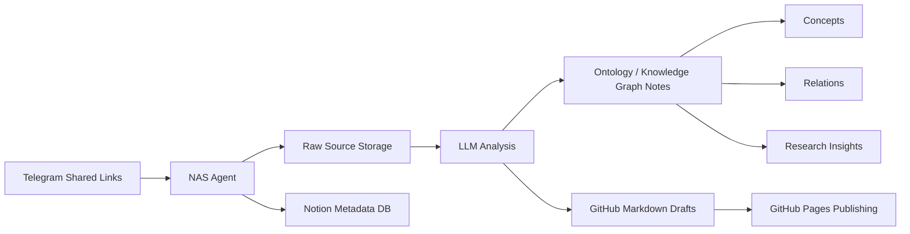
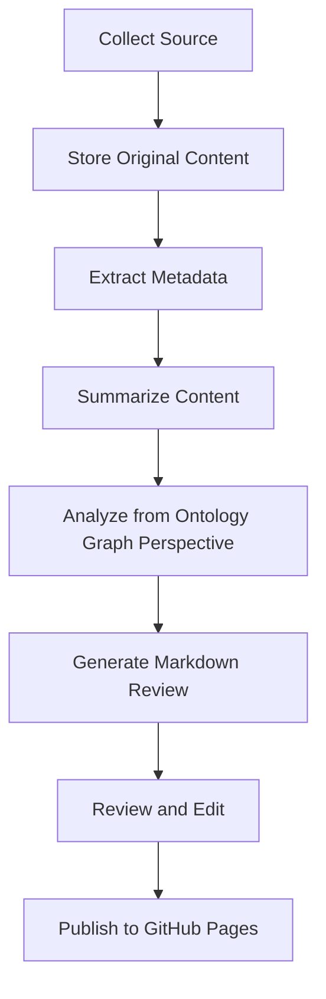

# ontology-knowledge-hub

> A curated knowledge hub for Ontology, Knowledge Graph, GraphRAG, and AI Agent research notes, technical reviews, and implementation insights.

---

## Korean Description

**Ontology Knowledge Hub**는 Ontology, Knowledge Graph, GraphRAG, AI Agent와 관련된 논문, 기술 블로그, GitHub 프로젝트, 구현 아이디어를 수집하고 정리하는 개인 지식 저장소입니다.

이 저장소의 목적은 단순히 자료를 모으는 것이 아니라, 각 자료를 전문적으로 분석하고, 핵심 개념과 관계를 추출하며, NAS Agent와 연계하여 장기적으로 활용 가능한 지식 아카이브를 구축하는 것입니다.

특히 다음과 같은 주제를 중심으로 정리합니다.

- Ontology 기반 지식 구조화
- Knowledge Graph 설계와 활용
- GraphRAG 및 Hybrid RAG 아키텍처
- AI Agent의 도구 사용과 실행 제어
- Semantic Layer와 지식 연결
- 논문 및 기술 글 리뷰
- NAS Agent 기반 개인 지식 자동화

---

## English Description

**Ontology Knowledge Hub** is a curated personal knowledge repository for collecting and organizing research papers, technical articles, GitHub projects, and implementation ideas related to Ontology, Knowledge Graphs, GraphRAG, and AI Agents.

The goal of this repository is not only to store resources, but also to analyze them professionally, extract key concepts and relationships, and build a long-term knowledge archive that can be connected with a NAS Agent workflow.

This repository mainly focuses on:

- Ontology-based knowledge structuring
- Knowledge Graph design and application
- GraphRAG and Hybrid RAG architectures
- AI Agent tool use and execution control
- Semantic Layer and knowledge linking
- Research paper and technical article reviews
- Personal knowledge automation with NAS Agent

---

## Repository Concept



---

## Knowledge Workflow



---

## Main Categories

| Category | Description |
|---|---|
| `ontology/` | Notes about ontology modeling, semantic structures, and concept relationships |
| `knowledge-graph/` | Knowledge Graph design patterns, use cases, and implementation notes |
| `graphrag/` | GraphRAG, Hybrid RAG, retrieval architecture, and related research |
| `ai-agent/` | AI Agent architecture, tool calling, workflow control, and execution safety |
| `papers/` | Paper reviews and research summaries |
| `technical-reviews/` | Reviews of blog posts, GitHub repositories, and technical articles |
| `nas-agent/` | Notes related to NAS Agent integration and automation workflows |

---

## Suggested Folder Structure

```text
ontology-knowledge-hub/
├── README.md
├── ontology/
├── knowledge-graph/
├── graphrag/
├── ai-agent/
├── papers/
├── technical-reviews/
├── nas-agent/
├── assets/
│   └── images/
└── templates/
    ├── paper-review-template.md
    └── technical-review-template.md
```

---

## Review Template

Each technical review or paper note can follow this structure.

```markdown
# Title

## 1. Source Information

- Source:
- Author:
- Published Date:
- Source Type:
- Tags:

## 2. Why This Matters

## 3. Key Ideas

## 4. Ontology / Knowledge Graph Perspective

## 5. Relation to GraphRAG or AI Agent Architecture

## 6. Implementation Insights

## 7. Limitations and Critical Review

## 8. Related Concepts

## 9. References
```

---

## Purpose

This repository aims to become a structured knowledge archive that connects:

```text
Research Papers
+ Technical Blogs
+ GitHub Projects
+ Personal Notes
+ NAS Agent Automation
+ Ontology Graph Thinking
```

into a reusable knowledge base for future AI Agent, GraphRAG, and ontology-based system design.

---

## License

This repository is maintained as a personal research and technical knowledge archive.


