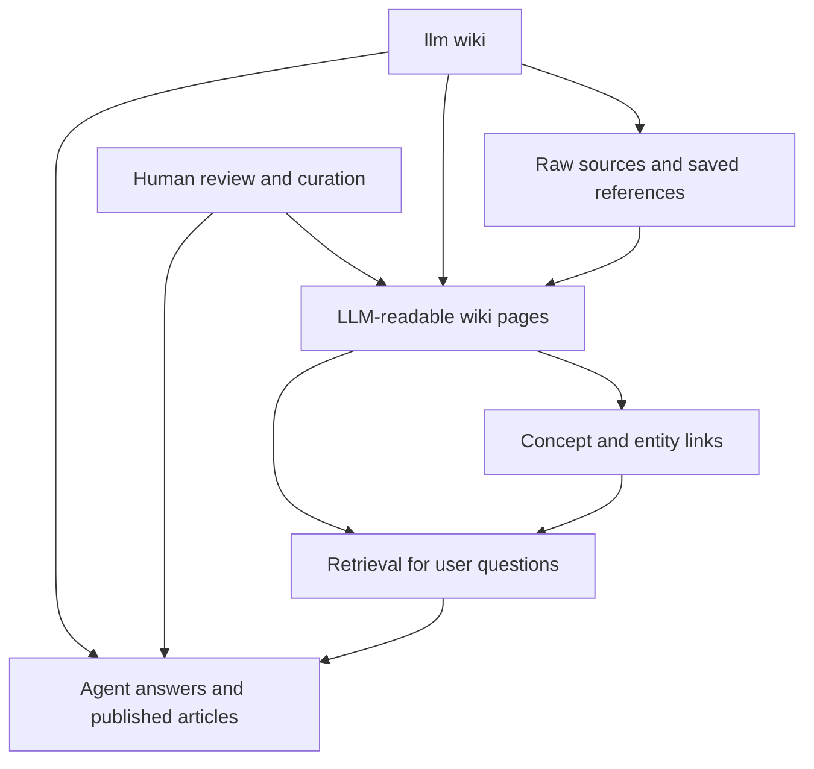

# llm wiki 기술 리뷰: RAG를 넘어, 축적·연결·검증되는 LLM 기반 위키 시스템

## 1. Executive Summary

`llm wiki`는 단순한 문서 검색이나 일회성 질의응답을 넘어, LLM이 읽기 쉬운 형태로 지식을 정리하고, 개념 간 연결을 유지하며, 시간이 지날수록 더 구조화된 지식 자산으로 진화시키는 패턴을 가리킨다. 제공된 내부 근거에 따르면, 이 주제는 “AI가 스스로 진화하는 지식 베이스”라는 문제의식과 함께 소개되었고, 특히 Claude Code와 Obsidian을 활용해 문서 자동 읽기, 요약, 연결, 모순 탐지까지 수행하는 워크플로로 설명된다.[5][7][8]

이 관점에서 `llm wiki`는 기존 RAG의 단점을 보완하는 설계 선택지다. 전통적 RAG는 문서를 청크로 나누고 임베딩 기반으로 검색한 뒤 답변을 생성하는 데 강하지만, 문서 사이의 개념 구조, 장기적 정제, 모순 관리, 문서 간 연결 유지에는 약하다. 반면 `llm wiki`는 문서를 LLM-readable page로 재구성하고, concept/entity link를 만들어 지식 그래프적 탐색과 문서 수준의 유지보수를 가능하게 한다는 점에서 차별화된다. 다만 “스스로 진화하는”이라는 표현은 마케팅적 수사로 오해될 수 있으며, 실제로는 자동화된 생성과 인간 검토가 결합된 semi-autonomous knowledge maintenance에 가깝다. 이 점은 반드시 분리해서 이해해야 한다.

외부 GitHub 근거를 보면, `llm wiki`라는 키워드는 이미 여러 형태의 구현으로 나타나고 있다. Tencent의 WeKnora는 원문 설명에서 raw documents를 queryable RAG, autonomous reasoning agent, self-maintaining Wiki로 전환하는 플랫폼을 표방하고 있고, Understand-Anything은 Karpathy식 LLM wiki를 interactive knowledge graph로 확장하는 방향을 제시한다. PandaWiki는 보다 전통적인 AI-driven knowledge base / documentation system에 가깝다. 이들 저장소는 구현 예시와 제품화 방향을 보여주지만, star 수만으로 기술적 우수성을 단정할 수는 없다.

본 리뷰의 핵심 판단은 다음과 같다.

- `llm wiki`는 “RAG 대체재”라기보다 “RAG를 포함하는 상위 지식 운영 구조”로 보는 편이 정확하다.
- 성공 여부는 LLM 성능보다도 문서 모델, 링크 정책, contradiction detection, human review workflow 설계에 좌우된다.
- 조직/개인 지식 시스템에 적용하려면 ingest → normalize → page synthesis → graph linking → retrieval → answer/publication → review의 폐쇄 루프를 설계해야 한다.
- 완전 자동화보다 검증 가능한 반자동화가 실용적이다.

## 2. Why This Topic Matters Now

### 사실: 내부 근거
제공된 내부 문서에는 해당 주제가 “Andrej Karpathy가 공개한 LLM Wiki 패턴”을 바탕으로 하며, Claude Code와 Obsidian을 이용해 문서 자동 읽기·요약·연결·모순 탐지까지 수행하는 개인 지식 베이스 구축 가이드라고 명시되어 있다.[8] 또한 “RAG의 한계를 보완”하고 “시간이 지날수록 지식이 누적·정련되는 워크플로”와 “웹 인터페이스 구성”을 다룬다고 적혀 있다.[8]

### 해석
이 설명은 `llm wiki`가 단순한 note-taking 툴이나 단일 검색 엔진이 아니라, 다음 세 가지 흐름이 합쳐진 영역임을 시사한다.

1. **LLM-native 문서화**: 사람이 읽는 문서를 그대로 두는 것이 아니라, 모델이 더 잘 읽고 연결할 수 있도록 재구성.
2. **지식 그래프화**: 개념·엔티티 중심 링크를 통해 탐색성과 유지보수성을 높임.
3. **지속적 정제**: 새 문서가 들어올 때 기존 지식과의 중복, 상충, 갱신 여부를 판단.

### 왜 지금 중요한가
지금 이 주제가 중요한 이유는 기술적·운영적 배경이 동시에 성숙했기 때문이다.

- LLM의 긴 컨텍스트와 tool use가 개선되면서, 문서 변환과 링크 생성 자동화가 현실적인 비용 수준에 접근했다.
- 개인/팀 단위 knowledge base가 급격히 늘었지만, 검색만으로는 “이 지식이 최신인가?”, “다른 문서와 충돌하는가?”, “핵심 개념이 어디에 정리돼 있는가?”에 답하기 어렵다.
- agentic system이 확산되면서, 에이전트가 참조할 안정적이고 구조화된 메모리 계층이 필요해졌다.

단, “중요하다”는 판단은 시장 추세와 일반적 기술 흐름에 근거한 추론이며, 제공된 자료만으로 산업 전반 채택률을 입증할 수는 없다.  
**Needs verification:** 실제 조직 도입 사례, 운영 비용, 유지관리 인력 요구 수준은 추가 검증이 필요하다.

## 3. Internal Knowledge Context

### 내부 증거
- `claude-code` 개념은 해당 LLM Wiki 구축 가이드를 ingest하는 과정에서 처음 등장했다.[1][2]
- `contradiction-detection` 개념 역시 같은 문서를 ingest하면서 처음 등장했다.[3][4]
- 원문 제목은 “🧠 AI가 스스로 진화하는 지식 베이스! LLM Wiki 구축 가이드”다.[5][7]
- 요약 설명에는 Claude Code, Obsidian, 자동 읽기/요약/연결/모순 탐지, RAG 보완, 웹 인터페이스가 포함된다.[8]

### 분석
내부 위키 관점에서 중요한 것은 이 토픽이 단순한 용어가 아니라 이미 개념 노드들을 생성했다는 점이다. 최소한 아래 두 개념은 중심 축으로 보인다.

- **Claude Code**: 문서 읽기/편집/생성 자동화의 실행 에이전트 혹은 개발 인터페이스 역할
- **Contradiction Detection**: 누적 지식 시스템에서 필수적인 품질 제어 메커니즘

이는 내부 지식 그래프가 단순한 문서 목록이 아니라, 자동화 도구와 검증 절차를 함께 모델링하는 방향으로 발전하고 있음을 의미한다. 특히 contradiction detection이 초기에 등장했다는 것은, `llm wiki`가 “생성”보다 “정합성 유지”를 핵심 문제로 본다는 해석을 가능하게 한다.

### 추론
내부 시스템에 이 토픽을 적용할 때는 최소한 다음 타입의 페이지 모델이 필요할 가능성이 높다.

- source/reference page
- concept page
- entity page
- synthesis/article page
- issue/conflict page

이는 제공된 자료에 직접 명시되지는 않았지만, “자동 읽기·요약·연결·모순 탐지”를 운영 가능한 시스템으로 바꾸려면 거의 필수적인 구조다.  
**Needs verification:** 현재 내부 위키의 실제 페이지 스키마와 링크 규칙은 별도 확인이 필요하다.

## 4. Core Concepts and Definitions

### 4.1 LLM Wiki
LLM Wiki는 LLM이 소비하고 갱신하기 쉬운 형식으로 구성된 위키형 지식 베이스다. 핵심은 Markdown 문서를 벡터 검색 대상으로만 두지 않고, 문서 간 관계와 요약된 개념 페이지를 함께 유지한다는 데 있다.

### 4.2 RAG와의 관계
- **RAG**: 질문 시점에 관련 청크를 검색해 답변 생성
- **LLM Wiki**: 질문 이전 단계에서 문서를 정리·정제·연결해 더 나은 검색과 추론 기반을 마련

즉, `llm wiki`는 RAG를 대체하기보다 RAG의 upstream knowledge preparation layer로 작동하는 경우가 많다.

### 4.3 Knowledge Graph
`llm wiki`에서 그래프는 RDF 같은 엄격한 ontology일 필요는 없다. 문서 링크, 개념 페이지, 엔티티 참조, 출처 연결만으로도 실용적인 graph layer가 된다. Understand-Anything의 설명도 “interactive knowledge graph”를 핵심 가치로 제시한다.

### 4.4 Contradiction Detection
누적형 지식 시스템에서는 새 문서가 들어올 때 기존 개념과 충돌할 수 있다. contradiction detection은 이러한 불일치를 자동 발견하거나 검토 후보로 올리는 과정이다. 내부 근거에서 이미 독립 개념으로 추출된 점은 이 기능이 부가 옵션이 아니라 핵심 설계 요소임을 보여준다.[3][4]

### 4.5 Human Review / Curation
“스스로 진화”라는 표현에도 불구하고, 실제 운영에서는 human-in-the-loop가 필요하다. 자동 생성된 링크, 요약, 상충 판단은 오탐·누락 가능성이 있다. 따라서 curation은 선택이 아니라 필수다.

## 5. GitHub Reference Projects

아래 프로젝트들은 “참고 사례”로만 사용해야 한다. star 수는 관심도를 반영할 수 있으나, 품질·안정성·운영 적합성을 증명하지는 않는다.

### 비교 요약

| 프로젝트 | URL | Stars | 수집일 | 주된 성격 |
|---|---|---:|---|---|
| Tencent/WeKnora | https://github.com/Tencent/WeKnora | 14503 | 2026-05-09 | 문서를 RAG/agent/wiki로 전환하는 통합 knowledge platform |
| Lum1104/Understand-Anything | https://github.com/Lum1104/Understand-Anything | 13600 | 2026-05-09 | codebase/knowledge base를 interactive knowledge graph로 시각화·탐색 |
| chaitin/PandaWiki | https://github.com/chaitin/PandaWiki | 9537 | 2026-05-09 | AI-driven 오픈소스 문서/FAQ/블로그/위키 구축 시스템 |

## 6. Project-by-Project Analysis

### 6.1 Tencent/WeKnora
- **URL**: https://github.com/Tencent/WeKnora
- **Stars**: 14,503
- **Collection date**: 2026-05-09
- **Purpose**: raw documents를 “queryable RAG”, “autonomous reasoning agent”, “self-maintaining Wiki”로 전환하는 오픈소스 LLM knowledge platform이라고 설명된다.
- **강점**
  - RAG, agent, wiki를 하나의 파이프라인으로 묶어 설명한다는 점에서 `llm wiki`의 통합 아키텍처와 잘 맞는다.
  - 대규모 플랫폼 지향성이 강해, ingestion 이후 활용 경로를 여러 갈래로 열어둔 구조로 보인다.
  - description 상 “self-maintaining Wiki”를 명시적으로 표방한다.
- **한계**
  - 제공된 근거만으로는 실제 내부 데이터 모델, contradiction detection 방식, revision policy를 알 수 없다.
  - `license_spdx_id`는 `NOASSERTION`으로 제공되어 있으나, README 배지에는 MIT 표시가 보인다. 이 불일치는 라이선스 확인이 필요하다.
  - star 수가 높더라도 운영 복잡도나 생산 투입량은 별개다.
- **재사용 가능한 점**
  - 문서 입력을 다중 출력물(RAG index, agent memory, wiki page)로 변환하는 product framing
  - knowledge platform 관점의 통합 UI/UX 설계 아이디어
- **Needs verification**
  - self-maintaining의 실제 범위: 자동 갱신인지, 반자동 큐레이션인지
  - 라이선스 상태
  - 엔터프라이즈 운영 적합성

### 6.2 Lum1104/Understand-Anything
- **URL**: https://github.com/Lum1104/Understand-Anything
- **Stars**: 13,600
- **Collection date**: 2026-05-09
- **Purpose**: codebase 또는 knowledge base(Karpathy LLM wiki)를 interactive knowledge graph로 바꾸어 탐색, 검색, 질문할 수 있게 하는 도구로 설명된다.
- **강점**
  - `llm wiki`를 graph exploration 문제로 확장했다는 점이 매우 중요하다.
  - Claude Code, Codex, Cursor, Copilot, Gemini CLI 등 여러 에이전트/도구와의 호환성을 강조한다.
  - README 설명만 보면, 문서 기반 지식을 “탐색 가능한 구조”로 전환하는 데 집중한다.
- **한계**
  - graph가 시각화 중심인지, 추론/검증까지 포함하는지 근거가 부족하다.
  - interactive graph는 인지적 가치를 주지만, 실제 answer quality 개선으로 직결되는지는 별도 검증이 필요하다.
  - 대규모 문서셋에서 graph clutter를 어떻게 다루는지 제공 자료만으로 판단 불가.
- **재사용 가능한 점**
  - concept/entity 중심 UI
  - 검색과 질의응답을 graph navigation과 결합하는 인터페이스 발상
  - Claude Code 기반 workflow와 연결되는 실무 친화적 positioning
- **Needs verification**
  - graph 생성 알고리즘
  - 대규모 데이터셋 성능
  - provenance와 contradiction review 기능의 존재 여부

### 6.3 chaitin/PandaWiki
- **URL**: https://github.com/chaitin/PandaWiki
- **Stars**: 9,537
- **Collection date**: 2026-05-09
- **Purpose**: AI 대모델 기반 오픈소스 knowledge base 구축 시스템으로, 제품 문서, 기술 문서, FAQ, 블로그 시스템 구축을 지원하고 AI 창작·Q&A·검색을 제공한다고 소개된다.
- **강점**
  - 전통적인 documentation/wiki publishing에 AI 기능을 결합한 형태로 보인다.
  - self-hosted 문서 시스템 관점에서 현실적 적용 가능성이 높아 보인다.
  - 문서 저작과 공개 위키 프런트엔드를 함께 고려한 제품형 구조다.
- **한계**
  - `llm wiki`의 핵심인 graph link maintenance나 contradiction detection이 제공 자료상 명확하지 않다.
  - AI-enhanced docs platform에 가깝고, knowledge graph 기반 정제 시스템인지는 불분명하다.
  - Chinese-language 중심 프로젝트일 가능성이 있어, 도입 조직의 언어/커뮤니티 적합성 검토가 필요하다.
- **재사용 가능한 점**
  - public-facing wiki/front-end 구성 방식
  - AI writing, AI search, AI Q&A를 문서 포털에 통합하는 product pattern
- **Needs verification**
  - graph-like link model 지원 여부
  - versioning과 editorial workflow 수준
  - multilingual support 범위

## 7. Topic Diagram

이 다이어그램은 `llm wiki`를 단지 검색 인덱스가 아니라, source에서 page를 만들고, link를 생성하고, retrieval과 answer/publication으로 이어지며, human review가 다시 page와 publication에 피드백되는 순환 구조로 보여준다. 실무적으로 가장 중요한 부분은 `V["Human review and curation"]`가 별도 노드로 존재한다는 점이다. 이 구조가 없으면 시스템은 빠르게 “생성된 텍스트 저장소”로 퇴화한다.

## 8. Application Design for the Knowledge System

### 8.1 권장 아키텍처
내부 맥락과 외부 사례를 종합하면, 다음 계층형 설계를 권장할 수 있다.

1. **Source Layer**
   - 웹 문서, PDF, 메모, 회의록, 코드 문서, 기존 위키
   - 원문 URL, 수집 시각, 저작권/사용 범위 메타데이터 저장

2. **Normalization Layer**
   - 텍스트 추출
   - 문서 구조 인식(제목, 섹션, 표, 코드 블록)
   - 중복 제거와 canonical source 지정

3. **Wiki Page Synthesis Layer**
   - source summary page
   - concept page
   - entity page
   - topic synthesis page
   - open questions / contradiction page

4. **Link & Graph Layer**
   - concept-to-source
   - concept-to-concept
   - entity-to-entity
   - claim-to-evidence
   - contradiction-to-affected-pages

5. **Retrieval Layer**
   - full-text search
   - embedding search
   - graph neighborhood retrieval
   - recency / authority / verification weighting

6. **Answer & Publishing Layer**
   - user Q&A
   - internal briefing
   - publishable review article
   - changelog / update digest

7. **Review Layer**
   - 승인 대기 링크
   - 모순 후보 검토
   - stale page 알림
   - low-confidence summary 재검토

### 8.2 왜 이런 설계가 필요한가
RAG만으로는 “어느 문서가 중심 개념 문서인지”, “서로 충돌하는 설명이 있는지”, “이 답변이 어떤 개념 구조를 따라 생성됐는지”를 관리하기 어렵다. 반면 `llm wiki`는 retrieval 이전에 지식을 구조화하므로, 답변 품질뿐 아니라 유지보수성과 재사용성을 높일 수 있다.

### 8.3 Claude Code와 Obsidian의 역할
내부 근거에서는 Claude Code와 Obsidian이 언급된다.[8] 이를 기능적으로 해석하면:

- **Claude Code**: 문서 읽기, 요약, refactor, 링크 생성, diff 제안의 자동화 실행기
- **Obsidian**: 사람 중심의 wiki 편집·링크 탐색 인터페이스

즉, 하나는 automation engine, 다른 하나는 human curation workspace로 볼 수 있다.  
**Needs verification:** 실제 사용 예에서 Claude Code가 어느 수준까지 파일 시스템 자동 편집을 수행하는지, Obsidian 플러그인/렌더링 의존성이 있는지는 추가 확인 필요.

## 9. Recommended Implementation Plan

### Phase 1: 최소 실행 가능 구조
- source/reference 저장소 정리
- Markdown 기반 canonical page format 정의
- frontmatter에 `source_url`, `collected_at`, `confidence`, `review_status` 추가
- 개념 페이지 자동 생성은 하되, 게시 전 human review 필수

### Phase 2: 링크 자동화
- 새 문서 ingest 시 기존 concept/entity 후보 매칭
- backlink 자동 생성
- “유사 주장”, “갱신 가능성”, “상충 가능성” 태그 부여
- low-confidence 링크는 별도 review queue로 분리

### Phase 3: contradiction detection
- claim extraction
- claim normalization
- 상반 표현 탐지 규칙 + LLM 판정 결합
- 충돌 결과를 즉시 본문에 반영하지 말고 issue page로 생성

### Phase 4: retrieval 고도화
- hybrid retrieval: BM25 + embedding + graph traversal
- 질문 유형별 retrieval 전략 분리
  - factual query
  - comparative query
  - change-over-time query
  - synthesis query

### Phase 5: publication pipeline
- 질의응답 결과를 article draft로 승격
- 출처 링크 자동 삽입
- “사실 / 내부 근거 / 추론” 섹션 템플릿화
- 게시 전 checklist 기반 검토

## 10. Risks, Limits, and Verification Checklist

### 주요 리스크

#### 10.1 자동 요약의 왜곡
LLM이 source를 정리하는 과정에서 nuance가 사라질 수 있다. 특히 technical trade-off, version constraint, license condition은 쉽게 누락된다.

#### 10.2 링크 과생성
모든 문서가 모든 개념과 연결되면 graph는 금방 noise가 된다. link precision을 희생한 recall 중심 전략은 초기에 매력적이지만 장기적으로 유지보수 비용을 폭증시킨다.

#### 10.3 contradiction detection의 오탐
표현 차이와 실제 모순은 다르다. 예를 들어 버전 차이, 적용 범위 차이, 환경 차이로 인해 표면상 모순처럼 보일 수 있다.

#### 10.4 출처 추적 약화
정제된 wiki 페이지가 편리해질수록 사용자는 원문을 덜 보게 된다. 따라서 source provenance를 강하게 남겨야 한다.

#### 10.5 라이선스와 재사용 범위
외부 문서를 자동 ingest하여 wiki에 재구성할 때, 저장·가공·재배포가 허용되는지 확인해야 한다. GitHub README 이미지나 뱃지도 재사용 전 라이선스 검토가 필요하다.

### 검증 체크리스트

- [ ] 모든 wiki page에 원문 출처와 수집 일자가 있는가
- [ ] 요약 문장마다 source trace가 가능한가
- [ ] concept/entity link 생성 기준이 문서화되어 있는가
- [ ] contradiction 후보는 issue queue를 거치는가
- [ ] low-confidence 생성물은 사람 검토 없이 게시되지 않는가
- [ ] stale page를 식별하는 freshness 정책이 있는가
- [ ] GitHub 프로젝트의 라이선스와 실제 재사용 범위를 확인했는가
- [ ] 시각 자료 후보가 있다면 라이선스 검토 후 별도 관리하는가

## 11. Conclusion

`llm wiki`는 오늘날의 LLM 응용에서 꽤 중요한 전환점을 보여준다. 핵심은 “검색을 더 잘하는 것”이 아니라 “지식을 더 잘 운영하는 것”이다. 내부 근거는 이 접근이 Claude Code, Obsidian, 자동 읽기·요약·연결·모순 탐지, 그리고 RAG 보완이라는 실천적 문제의식 위에 서 있음을 보여준다.[8] 외부 GitHub 사례들은 이 방향이 단지 아이디어 수준이 아니라, knowledge platform, interactive graph, AI-enhanced wiki product라는 여러 구현 형태로 현실화되고 있음을 시사한다.

그러나 이 주제를 과장해서는 안 된다. `llm wiki`는 마법 같은 자율 지식 시스템이 아니라, 자동화와 편집 체계를 함께 설계해야 하는 운영 문제다. 가장 좋은 구현은 가장 화려한 graph가 아니라, 출처가 명확하고, 모순이 관리되며, 시간이 지나도 품질이 올라가는 시스템이다.

실무적 권고는 명확하다. 먼저 작은 범위의 고신뢰 문서셋에서 시작하고, page schema와 provenance를 엄격히 잡은 뒤, 링크 자동화와 contradiction detection을 점진적으로 붙여라. 그리고 질문 응답보다 먼저 “지식이 어떻게 정리되고 검토되는가”를 설계하라. `llm wiki`의 성패는 결국 모델이 아니라 운영 구조가 결정한다.

## 12. References

### Internal knowledge context
1. `wiki/concepts/claude-code.md:4` — This concept was first seen while ingesting [[🧠 AI가 스스로 진화하는 지식 베이스! LLM Wiki 구축 가이드]].
2. `wiki/concepts/claude-code.md:7` — - [[🧠 AI가 스스로 진화하는 지식 베이스! LLM Wiki 구축 가이드]]
3. `wiki/concepts/contradiction-detection.md:4` — This concept was first seen while ingesting [[🧠 AI가 스스로 진화하는 지식 베이스! LLM Wiki 구축 가이드]].
4. `wiki/concepts/contradiction-detection.md:7` — - [[🧠 AI가 스스로 진화하는 지식 베이스! LLM Wiki 구축 가이드]]
5. `references/pages/2026-04-25-fornewchallenge.tistory.com-ai-llm-wiki.md:2` — title: "🧠 AI가 스스로 진화하는 지식 베이스! LLM Wiki 구축 가이드"
6. `references/pages/2026-04-25-fornewchallenge.tistory.com-ai-llm-wiki.md:3` — URL: https://fornewchallenge.tistory.com/entry/%F0%9F%A7%A0-AI%EA%B0%80-%EC%8A%A4%EC%8A%A4%EB%A1%9C-%EC%A7%84%ED%99%94%ED%95%98%EB%8A%94-%EC%A7%80%EC%8B%9D-%EB%B2%A0%EC%9D%B4%EC%8A%A4-LLM-Wiki-%EA%B5%AC%EC%B6%95-%EA%B0%80%EC%9D%B4%EB%93%9C#google_vignette
7. `references/pages/2026-04-25-fornewchallenge.tistory.com-ai-llm-wiki.md:9` — # 🧠 AI가 스스로 진화하는 지식 베이스! LLM Wiki 구축 가이드
8. `references/pages/2026-04-25-fornewchallenge.tistory.com-ai-llm-wiki.md:12` — Andrej Karpathy가 공개한 LLM Wiki 패턴을 바탕으로 Claude Code와 Obsidian을 활용해, 문서 자동 읽기·요약·연결·모순 탐지까지 수행하는 ‘스스로 진화하는’ 개인 지식 베이스를 구축하는 방법을 단계별로 소개한다. RAG의 한계를 보완하고 시간이 지날수록 지식이 누적·정련되는 워크플로와 웹 인터페이스 구성도 다룬다.

### GitHub reference projects
- Tencent/WeKnora — https://github.com/Tencent/WeKnora — 14,503 stars — collected at 2026-05-09
- Lum1104/Understand-Anything — https://github.com/Lum1104/Understand-Anything — 13,600 stars — collected at 2026-05-09
- chaitin/PandaWiki — https://github.com/chaitin/PandaWiki — 9,537 stars — collected at 2026-05-09

### Note on media and assets
- GitHub README 내 로고, 배너, 스크린샷은 기사 삽입 후보가 될 수 있으나, 본 문서에서는 재사용하지 않았다.
- 외부 이미지 사용 전 각 저장소의 라이선스 및 이미지 자산의 별도 저작권 상태를 검토해야 한다.
