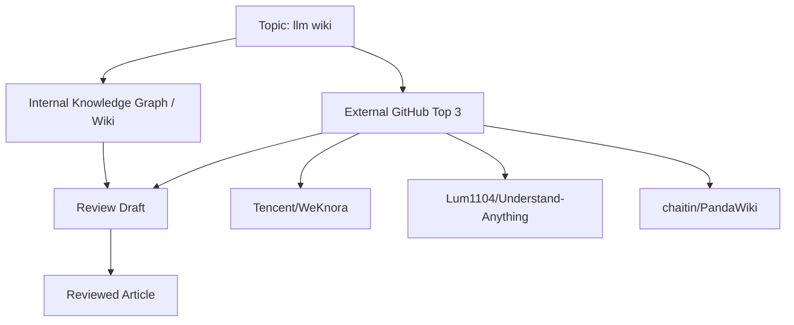

# LLM Wiki: 대규모 언어모델 시대의 지식 베이스를 다시 설계하는 방법

## 1. 왜 지금 이 주제가 중요한가

LLM Wiki는 단순한 “AI가 붙은 위키”가 아닙니다.  
핵심은 **문서를 저장하는 시스템**에서 **지식이 계속 정련되는 시스템**으로의 전환입니다.

기존 Wiki는 사람이 작성한 문서를 축적하는 데 강점이 있었지만, 정보가 늘어날수록 다음 문제가 커졌습니다.

- 문서 간 연결이 약해져 탐색 비용이 증가함
- 최신성과 정확성 유지에 많은 수작업이 필요함
- 유사 문서가 중복 생성되고, 모순이 누적됨
- 검색은 가능하지만 “이해”와 “정리”는 별개의 문제로 남음

LLM Wiki는 이러한 한계를 보완하려는 접근입니다.  
LLM을 활용해 문서를 읽고, 요약하고, 연결하고, 충돌을 탐지하며, 필요하면 다시 재구성하는 워크플로를 구성합니다. 즉, 위키가 정적인 저장소가 아니라 **지속적으로 업데이트되는 knowledge system**이 됩니다.

내부 메모에 따르면, 관련 글은 Andrej Karpathy가 공개한 “LLM Wiki” 패턴을 바탕으로 Claude Code와 Obsidian을 활용해 문서 자동 읽기·요약·연결·모순 탐지까지 수행하는 개인 지식 베이스 구축 방법을 소개하고 있습니다. 또한 RAG의 한계를 보완하고, 시간이 지날수록 지식이 누적·정련되는 워크플로를 다룬다고 정리되어 있습니다. 이 점이 이 주제를 현재 시점에서 특히 중요하게 만듭니다. [8]

---

## 2. 내부 Knowledge Graph에서 본 핵심 개념

내부 Knowledge Graph에서 확인되는 핵심 개념은 크게 두 가지입니다.

### 2.1 Claude Code
`claude-code` 개념은 내부 그래프상에서 **“🧠 AI가 스스로 진화하는 지식 베이스! LLM Wiki 구축 가이드”**를 ingest하는 과정에서 처음 관찰되었습니다. [1][2]

이는 단순한 도구 이름을 넘어서, **LLM Wiki를 운용하는 작업 인터페이스**로 해석할 수 있습니다.  
즉, Claude Code는 지식 베이스를 읽고, 갱신하고, 관계를 만들고, 반영하는 실행 레이어의 한 후보입니다.

### 2.2 Contradiction Detection
`contradiction-detection` 개념 역시 같은 가이드에서 처음 관찰되었습니다. [3][4]

이 개념은 LLM Wiki의 품질을 결정하는 핵심입니다.  
문서가 많아질수록 “정보가 있다”는 사실보다 중요한 것은 **정보 간 충돌을 어떻게 다루는가**입니다.  
LLM Wiki는 단순 검색이 아니라, 상충하는 설명을 탐지하고 정리하는 능력을 가져야 실사용 가치가 생깁니다.

---

## 3. 관련 내부 지식과 기존 메모

내부 reference 페이지는 LLM Wiki를 다음과 같이 요약하고 있습니다.

- Andrej Karpathy가 공개한 LLM Wiki 패턴을 바탕으로
- Claude Code와 Obsidian을 활용해
- 문서 자동 읽기, 요약, 연결, 모순 탐지까지 수행하며
- 개인 지식 베이스가 스스로 진화하는 구조를 만드는 방법을 설명한다는 점입니다. [7][8]

이 내부 메모에서 중요한 포인트는 다음과 같습니다.

1. **문서 생성보다 문서 정련이 중요하다**  
   LLM Wiki는 새 글을 쓰는 것보다, 기존 글을 읽고 고치는 흐름에서 가치가 커집니다.

2. **연결(linking)은 선택이 아니라 기본 기능이다**  
   위키는 단일 문서의 집합이 아니라 그래프 구조여야 합니다.

3. **모순 탐지는 핵심 유지보수 작업이다**  
   LLM이 작성한 요약도 서로 충돌할 수 있으므로, 검증 루프가 필요합니다.

4. **로컬 knowledge base와 자동화 에이전트의 결합이 중요하다**  
   Obsidian 같은 개인 지식 관리 환경과 Claude Code 같은 에이전트형 인터페이스를 조합하는 방향성이 드러납니다.

---

## 4. GitHub Top 3 참고 프로젝트

아래 3개 저장소는 GitHub 검색 결과 상 `llm wiki`와 높은 관련성을 가지는 참고 사례입니다.  
다만, star 수가 높다는 사실만으로 기술적 우수성을 단정할 수는 없습니다. 여기서는 **기능 방향성, 구조적 아이디어, 적용 가능성**을 중심으로 봐야 합니다.

### 4.1 Tencent/WeKnora
- URL: https://github.com/Tencent/WeKnora
- Star 수: 14,502
- Star 수집 날짜: 2026-05-09
- 설명: raw documents를 queryable RAG, autonomous reasoning agent, self-maintaining Wiki로 전환하는 오픈소스 LLM knowledge platform입니다.

### 4.2 Lum1104/Understand-Anything
- URL: https://github.com/Lum1104/Understand-Anything
- Star 수: 13,593
- Star 수집 날짜: 2026-05-09
- 설명: code나 knowledge base를 interactive knowledge graph로 바꾸고, 탐색·검색·질의를 가능하게 하는 도구입니다. Claude Code, Codex, Cursor, Copilot, Gemini CLI 등과 연동을 강조합니다.

### 4.3 chaitin/PandaWiki
- URL: https://github.com/chaitin/PandaWiki
- Star 수: 9,536
- Star 수집 날짜: 2026-05-09
- 설명: AI 대모델 기반 오픈소스 knowledge base 구축 시스템으로, 제품 문서·기술 문서·FAQ·블로그 시스템에 AI 창작, Q&A, 검색 기능을 제공하는 것을 목표로 합니다.

---

## 5. 프로젝트별 강점과 한계

### 5.1 Tencent/WeKnora
**강점**
- 문서를 단순 저장하지 않고, **RAG + reasoning agent + self-maintaining Wiki**라는 다층 구조로 본 점이 좋습니다.
- “self-maintaining”이라는 표현은 LLM Wiki가 지향해야 할 운영 모델을 잘 드러냅니다.
- knowledge platform 관점이라 실사용 시나리오가 넓습니다.

**한계**
- README excerpt만으로는 문서 정합성 관리, 충돌 해결, provenance 관리 방식까지는 확인되지 않습니다.
- “autonomous reasoning agent”가 실제로 어느 정도 자율성을 제공하는지는 추가 검증이 필요합니다.

### 5.2 Lum1104/Understand-Anything
**강점**
- knowledge base를 **interactive knowledge graph**로 변환하는 관점이 LLM Wiki와 매우 잘 맞습니다.
- Claude Code, Cursor, Copilot 등 개발자 친화적인 도구와의 연결성이 강합니다.
- “Graphs that teach > graphs that impress”라는 메시지는 그래프 시각화 자체보다 이해 가능성에 초점을 둡니다.

**한계**
- 그래프 생성과 이해 지원이 강하더라도, 지속적 동기화나 지식 충돌 관리가 얼마나 자동화되는지는 별도 확인이 필요합니다.
- knowledge graph가 “보기 좋은 구조”에 머물지 않고 “운영 가능한 지식 시스템”으로 이어지는지 확인해야 합니다.

### 5.3 chaitin/PandaWiki
**강점**
- 문서화 시스템으로서의 완성도가 중요한 환경에 적합합니다.
- AI 창작, AI Q&A, AI 검색을 통합한 점이 실무형입니다.
- FAQ, 기술 문서, 제품 문서처럼 반복적인 지식 관리 요구에 잘 맞습니다.

**한계**
- 위키 운영의 본질인 개념 그래프, 충돌 탐지, 출처 신뢰도 관리가 얼마나 정교한지는 제공된 정보만으로 판단하기 어렵습니다.
- “wiki”와 “knowledge base”의 기능은 넓게 보이지만, LLM Wiki의 핵심인 **지식 정련 루프**는 별도 설계가 필요할 수 있습니다.

---

## 6. 핵심 구조를 설명하는 Diagram

이 다이어그램은 다음 흐름을 보여줍니다.

- Topic인 `llm wiki`가 내부 Graph와 외부 GitHub 사례를 동시에 참조한다.
- 내부 지식은 개념 정의와 품질 관리 기준을 제공한다.
- 외부 프로젝트는 구현 패턴과 제품 관점을 제공한다.
- 두 입력을 합쳐 리뷰 초안을 만들고, 최종 검토된 아티클로 정제한다.

즉, 좋은 리뷰는 “외부 정보 요약”이 아니라 **내부 지식과 외부 사례의 교차 검증 결과**여야 합니다.

---

## 7. Knowledge System에 적용 가능한 설계

LLM Wiki를 실제로 운영하려면 다음 4계층으로 나누는 것이 유리합니다.

### 7.1 Ingestion Layer
문서, 노트, 웹페이지, 코드, 회의록 등을 수집합니다.  
이 단계의 핵심은 **원문 보존**입니다. 요약본만 저장하면 나중에 검증이 어려워집니다.

### 7.2 Structuring Layer
LLM이 다음 작업을 수행합니다.

- 요약
- 키워드 추출
- 엔터티 식별
- 문서 간 링크 제안
- 중복 문서 병합 후보 탐지
- 모순 가능성 탐지

### 7.3 Knowledge Graph Layer
문서와 개념을 graph로 연결합니다.

- Document node
- Concept node
- Claim node
- Source node
- Contradiction node
- Review status node

이 계층이 있어야 위키가 단순한 문서 목록이 아니라 **관계 기반 지식 시스템**이 됩니다.

### 7.4 Review / Governance Layer
자동화가 아무리 좋아도 최종 검토 체계가 필요합니다.

- 신뢰도 높은 source 우선
- 변경 이력 추적
- 승인/보류 상태 관리
- 충돌 해결 로그 유지
- 인간 검수 기준 설정

---

## 8. 추천 아키텍처

실무적으로는 아래 구성이 가장 현실적입니다.

### 권장 구성
- **Storage**: Markdown + object storage + version control
- **Knowledge layer**: graph DB 또는 graph-like metadata model
- **Retrieval**: hybrid search(BM25 + vector search)
- **LLM orchestration**: agent workflow
- **Editor**: Obsidian, web editor, 혹은 docs CMS
- **Validation**: contradiction detection, citation check, diff review
- **Automation**: scheduled ingestion + change detection

### 운영 원칙
1. **원문과 생성물을 분리**한다.  
2. **요약과 검증을 분리**한다.  
3. **검색과 이해를 분리**한다.  
4. **자동화와 승인 권한을 분리**한다.  

이렇게 해야 LLM Wiki가 “편하지만 위험한” 시스템이 아니라 “자동화되었지만 통제 가능한” 시스템이 됩니다.

---

## 9. 구현 시 주의할 점

### 9.1 환각(hallucination) 관리
LLM이 만든 연결이나 요약은 항상 사실로 취급하면 안 됩니다.  
특히 새로운 개념을 자동으로 생성할 때는 source reference를 반드시 남겨야 합니다.

### 9.2 모순 탐지는 자동화하되, 판정은 보수적으로
contradiction detection은 “모순 가능성”을 찾아내는 도구로 쓰는 편이 안전합니다.  
최종 판정은 context와 source를 함께 검토해야 합니다.

### 9.3 그래프가 목적이 되지 않게 할 것
knowledge graph는 유용하지만, 시각화 자체가 목적이 되면 유지보수 비용만 올라갑니다.  
핵심은 **지식의 갱신성과 탐색성**입니다.

### 9.4 문서 품질 규칙이 필요하다
예를 들면:
- 각 문서에 source/last reviewed/date를 기록
- 주장과 의견을 분리
- 추론과 사실을 분리
- 오래된 항목은 review queue로 이동

### 9.5 개인정보와 민감정보 관리
개인 knowledge base는 종종 민감한 정보를 포함합니다.  
LLM 처리 범위, 외부 API 전송, 로컬 실행 여부를 명확히 구분해야 합니다.

---

## 10. 결론

LLM Wiki는 “AI로 위키를 더 빨리 쓰는 도구”가 아니라,  
**AI를 이용해 지식이 스스로 정련되는 구조를 만드는 시스템**입니다.

내부 graph에서 확인된 `claude-code`, `contradiction-detection` 개념은 이 주제가 단순 문서 자동화가 아니라 **지식 운영의 자동화**로 확장되고 있음을 보여줍니다.  
또한 내부 메모는 Obsidian, Claude Code, 자동 요약·연결·모순 탐지를 결합한 워크플로를 제시하며, 이 방향이 현재 LLM Wiki의 핵심 설계 축임을 시사합니다.

외부 사례로 본 WeKnora, Understand-Anything, PandaWiki는 각각 knowledge platform, interactive knowledge graph, AI knowledge base라는 서로 다른 각도에서 이 문제를 다룹니다.  
공통점은 분명합니다. 이제 지식 시스템은 “저장”만으로는 부족하고, **해석·연결·검증·갱신**까지 포함해야 한다는 점입니다.

따라서 LLM Wiki를 설계할 때의 핵심 질문은 다음과 같습니다.

- 어떤 문서를 어떻게 읽고 구조화할 것인가?
- 어떤 연결을 자동화하고 어떤 연결은 검수할 것인가?
- 모순을 발견했을 때 어떤 규칙으로 처리할 것인가?
- 시간이 지날수록 지식 품질이 올라가도록 어떻게 피드백 루프를 만들 것인가?

이 질문에 답할 수 있다면, LLM Wiki는 단순한 위키를 넘어 **진화하는 knowledge system**이 됩니다.

---

## 11. 참고 자료

### 내부 Knowledge Graph / Wiki
- `wiki/concepts/claude-code.md`  
  - 처음 관찰된 출처: **🧠 AI가 스스로 진화하는 지식 베이스! LLM Wiki 구축 가이드** [1][2]
- `wiki/concepts/contradiction-detection.md`  
  - 처음 관찰된 출처: **🧠 AI가 스스로 진화하는 지식 베이스! LLM Wiki 구축 가이드** [3][4]
- `references/pages/2026-04-25-fornewchallenge.tistory.com-ai-llm-wiki.md`  
  - 제목: **🧠 AI가 스스로 진화하는 지식 베이스! LLM Wiki 구축 가이드** [5][7][8]
  - URL: https://fornewchallenge.tistory.com/entry/%F0%9F%A7%A0-AI%EA%B0%80-%EC%8A%A4%EC%8A%A4%EB%A1%9C-%EC%A7%84%ED%99%94%ED%95%98%EB%8A%94-%EC%A7%80%EC%8B%9D-%EB%B2%A0%EC%9D%B4%EC%8A%A4-LLM-Wiki-%EA%B5%AC%EC%B6%95-%EA%B0%80%EC%9D%B4%EB%93%9C#google_vignette [6]

### GitHub Top 3 references
1. **Tencent/WeKnora**  
   URL: https://github.com/Tencent/WeKnora  
   Star 수: 14,502  
   Star 수집 날짜: 2026-05-09

2. **Lum1104/Understand-Anything**  
   URL: https://github.com/Lum1104/Understand-Anything  
   Star 수: 13,593  
   Star 수집 날짜: 2026-05-09

3. **chaitin/PandaWiki**  
   URL: https://github.com/chaitin/PandaWiki  
   Star 수: 9,536  
   Star 수집 날짜: 2026-05-09

### 보충 설명
- 본 글은 내부 Knowledge Graph와 외부 GitHub 사례를 함께 참고해 작성했으며, 확인되지 않은 기능이나 성능 우위는 단정하지 않았습니다.
- 외부 프로젝트의 star 수는 인기도의 참고 지표일 뿐, 기술적 완성도의 직접적인 증거는 아닙니다.
