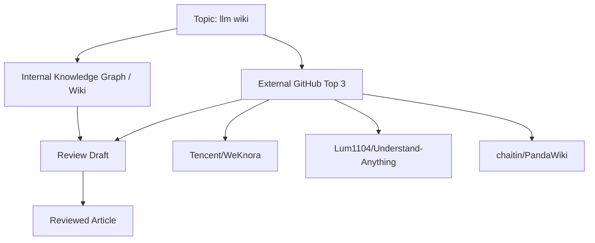

# LLM Wiki: LLM 시대의 개인 지식베이스를 어떻게 설계할 것인가

## 1. 왜 지금 이 주제가 중요한가

`llm wiki`는 단순히 “LLM으로 문서를 검색하는 시스템”이 아닙니다.  
최근의 핵심 흐름은 **문서를 저장하는 Wiki**에서 **LLM이 읽고, 요약하고, 연결하고, 모순까지 점검하는 지식 시스템**으로 이동하고 있습니다.

이 주제가 중요한 이유는 세 가지입니다.

1. **RAG의 한계를 보완하기 위해서**
   - 전통적 RAG는 “찾아온 문서 조각”에 크게 의존합니다.
   - 하지만 실제 지식 작업은 단순 검색보다 **맥락 연결, 개념 정리, 상충 정보 탐지**가 더 중요합니다.

2. **지식이 축적될수록 더 똑똑해지는 워크플로가 가능하기 때문**
   - 문서를 읽을 때마다 요약과 연결이 누적되면, Wiki는 정적 저장소가 아니라 **지식 정련 시스템**이 됩니다.
   - 즉, 시간이 지날수록 “검색 가능한 문서 모음”이 아니라 “구조화된 지식 그래프”에 가까워집니다.

3. **개인/팀 지식베이스의 운영 비용을 낮출 수 있기 때문**
   - 사람이 일일이 링크를 걸고 태그를 붙이고 중복을 제거하는 작업은 지속성이 떨어집니다.
   - LLM이 읽기·요약·관계 추론·모순 탐지의 일부를 맡으면 운영 부담을 줄일 수 있습니다.

---

## 2. 내부 Knowledge Graph에서 본 핵심 개념

내부 Wiki/Graph에서 이 주제와 직접 연결되는 핵심 개념은 다음 두 가지입니다.

### 2.1 `claude-code`
내부 그래프에서는 `claude-code` 개념이 **「🧠 AI가 스스로 진화하는 지식 베이스! LLM Wiki 구축 가이드」**를 ingest하는 과정에서 처음 관찰되었습니다.  
이는 LLM Wiki가 단지 UI나 저장 방식의 문제가 아니라, **AI 에이전트가 문서를 처리하는 실행 환경**과 연결된다는 점을 시사합니다.

즉, LLM Wiki의 실제 가치는 다음과 같은 agentic workflow와 맞닿아 있습니다.

- 문서 자동 읽기
- 문서 요약
- 개념 간 연결 생성
- 관련 파일/노트 탐색
- 반복 업데이트

### 2.2 `contradiction-detection`
같은 출처에서 `contradiction-detection` 개념도 처음 관찰되었습니다.  
이는 LLM Wiki가 검색 보조를 넘어서 **지식의 품질 관리**까지 확장될 수 있음을 보여줍니다.

특히 이 개념은 다음의 실용적 요구와 맞닿습니다.

- 오래된 문서와 최신 문서의 충돌 찾기
- 서로 다른 노트 간 정의 불일치 탐지
- 중복되지만 미세하게 다른 주장 비교
- “정확한 듯 보이지만 실제로는 상충하는 정보” 발견

정리하면, 내부 그래프는 LLM Wiki를  
**“읽고 → 연결하고 → 검증하는 지식 베이스”**로 정의하는 방향을 지지합니다.

---

## 3. 관련 내부 지식과 기존 메모

내부 참조에는 다음 문서가 포함되어 있습니다.

- `🧠 AI가 스스로 진화하는 지식 베이스! LLM Wiki 구축 가이드`  
  - 제목과 설명상, Andrej Karpathy의 LLM Wiki 패턴을 바탕으로 Claude Code와 Obsidian을 활용해 문서 자동 처리, 연결, 모순 탐지, 웹 인터페이스 구성까지 다루는 가이드입니다.  
  - 즉, 이 메모는 **LLM Wiki를 “자기 진화형 knowledge base”로 구현하는 방법론**에 가깝습니다.

이 내부 메모에서 읽을 수 있는 핵심 메시지는 다음과 같습니다.

- LLM Wiki는 단순 검색 UI가 아니라 **문서 수명주기를 자동화하는 시스템**
- Obsidian 같은 로컬 중심 도구와 Claude Code 같은 agentic tool을 조합해 **노트 그래프를 동적으로 정리**할 수 있음
- 핵심 가치는 “RAG를 대체”하는 것이 아니라, **RAG의 입력 품질과 지식 구조를 개선**하는 데 있음

---

## 4. GitHub Top 3 참고 프로젝트

아래는 GitHub 검색 결과에서 `llm wiki`와의 관련도가 높은 상위 3개 공개 저장소입니다.  
스타 수는 참고 지표일 뿐이며, 기술적 우수성을 자동으로 의미하지는 않습니다.

### 4.1 Tencent/WeKnora
- URL: https://github.com/Tencent/WeKnora
- Star: **14,501**
- Star 수집 날짜: **2026-05-09**
- 요약: raw document를 queryable RAG, autonomous reasoning agent, self-maintaining Wiki로 전환하는 오픈소스 LLM knowledge platform

### 4.2 Lum1104/Understand-Anything
- URL: https://github.com/Lum1104/Understand-Anything
- Star: **13,592**
- Star 수집 날짜: **2026-05-09**
- 요약: 코드베이스나 knowledge base를 interactive knowledge graph로 바꾸어 탐색·검색·질의할 수 있게 하는 도구. Claude Code, Codex, Cursor 등과 연동 가능

### 4.3 chaitin/PandaWiki
- URL: https://github.com/chaitin/PandaWiki
- Star: **9,536**
- Star 수집 날짜: **2026-05-09**
- 요약: AI 대형 모델 기반 오픈소스 knowledge base 구축 시스템. 제품 문서, 기술 문서, FAQ, 블로그를 AI 창작/질문/검색 기능과 함께 제공

---

## 5. 프로젝트별 강점과 한계

### 5.1 Tencent/WeKnora
**강점**
- “document → RAG → agent → self-maintaining Wiki”라는 흐름이 분명합니다.
- 단순 검색 시스템이 아니라 **유지되는 지식 플랫폼**을 지향합니다.
- `knowledge-base`, `agent`, `evaluation` 등 실무형 키워드가 강합니다.

**한계**
- README excerpt만으로는 실제 지식 그래프 모델링 방식, 문서 업데이트 정책, 모순 해결 전략의 깊이를 단정할 수 없습니다.
- “self-maintaining Wiki”라는 표현은 강력하지만, 실제 운영에서 얼마나 자동화되는지는 별도 검증이 필요합니다.

### 5.2 Lum1104/Understand-Anything
**강점**
- LLM Wiki를 knowledge graph 관점에서 재해석합니다.
- “graphs that teach > graphs that impress”라는 메시지처럼, 시각화보다 **이해 가능성**을 중시합니다.
- Claude Code, Cursor 등 실제 개발 워크플로와 맞물리는 점이 강점입니다.

**한계**
- knowledge graph를 만든다고 해서 곧바로 정답성을 보장하지는 않습니다.
- 그래프 생성 품질은 원문 구조, chunking, relation extraction 품질에 크게 좌우됩니다.
- 시각적으로 뛰어난 그래프와 실제 지식 정확성은 별개입니다.

### 5.3 chaitin/PandaWiki
**강점**
- 제품 문서, 기술 문서, FAQ, 블로그 등 실제 운영 문서에 바로 적용하기 좋은 구조입니다.
- AI 창작, AI Q&A, AI 검색을 하나의 knowledge base 경험으로 묶고 있습니다.
- self-hosted wiki 관점에서 실무 도입 장벽이 낮을 가능성이 있습니다.

**한계**
- README excerpt 기준으로는 “지식의 연결성”이나 “모순 탐지” 같은 고급 knowledge maintenance 기능은 확인되지 않습니다.
- 문서 생성·검색 기능이 중심이면, 장기적으로는 지식 정련보다 콘텐츠 관리에 가까워질 수 있습니다.

---

## 6. 핵심 구조를 설명하는 Diagram

이 다이어그램은 본 글의 작성 구조를 단순화한 것입니다.

- **Topic**은 분석 출발점
- **Internal Knowledge Graph**는 1차 해석의 기준
- **External GitHub Top 3**는 실무 사례의 외부 참조
- **Review Draft**는 내부 지식과 외부 사례를 통합한 초안
- **Reviewed Article**은 GitHub Pages 게시를 위한 최종 산출물입니다

---

## 7. Knowledge System에 적용 가능한 설계

LLM Wiki를 지식 시스템으로 설계할 때, 다음 4개 레이어가 중요합니다.

### 7.1 Ingestion Layer
문서를 가져오는 단계입니다.

- Markdown, HTML, PDF, docs, issue, chat log 등을 수집
- 문서 메타데이터를 표준화
- 버전 정보와 작성 시점을 함께 보존

핵심은 “많이 가져오는 것”이 아니라 **추적 가능한 형태로 가져오는 것**입니다.

### 7.2 Structuring Layer
문서를 구조화하는 단계입니다.

- chunking
- entity extraction
- topic clustering
- link suggestion
- summary generation

여기서 LLM은 “정답 생성기”보다 **구조 정리 도구**로 쓰는 편이 안정적입니다.

### 7.3 Maintenance Layer
지식의 품질을 유지하는 단계입니다.

- 중복 노트 탐지
- 오래된 내용 갱신
- 상충 주장 탐지
- 근거 링크 보존
- 변경 이력 기록

내부 graph의 `contradiction-detection` 개념은 이 레이어의 중요성을 잘 보여줍니다.

### 7.4 Serving Layer
사용자에게 보여주는 단계입니다.

- 검색
- Q&A
- graph navigation
- related notes
- source traceability

여기서 중요한 것은 “답변”보다 **근거를 함께 보여주는 것**입니다.  
LLM Wiki는 설명 가능성 없이 답만 잘하는 시스템이 되면 오래가지 못합니다.

---

## 8. 추천 아키텍처

실제로 GitHub Pages에 게시할 수준의 LLM Wiki 리뷰를 넘어서, 시스템 설계 관점에서 추천하는 아키텍처는 다음과 같습니다.

### 8.1 로컬 우선 + 원격 동기화
- 개인 메모와 운영 문서는 로컬 Markdown/Obsidian 형식으로 유지
- 주기적으로 index와 graph를 생성
- 필요 시 웹 인터페이스로 publish

장점:
- 데이터 소유권이 명확함
- 버전 관리가 쉬움
- 장기 유지보수에 유리함

### 8.2 LLM 기반 자동 링크 + 사람 검수
- LLM이 후보 링크와 요약을 제안
- 사람은 승인/수정만 수행
- 자동 연결을 전면 신뢰하지 않음

이 방식은 오류를 줄이면서도 생산성을 확보합니다.

### 8.3 모순 탐지 중심의 품질 관리
- 동일 개념에 대한 정의 충돌
- 날짜별 정책 변경
- 제품/기술 설명의 불일치
- 서로 다른 문서의 상충 수치

이 기능은 “지식이 늘어날수록 더 혼란스러워지는 Wiki”를 막는 데 중요합니다.

### 8.4 문서 단위와 개념 단위의 이중 모델
- 문서(document)는 원문 맥락을 유지
- 개념(concept)은 재사용 가능한 지식 단위로 관리

이중 모델이 있어야 검색과 탐색, 설명과 검증을 동시에 만족시킬 수 있습니다.

---

## 9. 구현 시 주의할 점

### 9.1 LLM 출력은 항상 검증이 필요하다
LLM이 생성한 요약, 링크, 관계 추론은 편리하지만 완전하지 않습니다.  
특히 지식 베이스에서는 **환각(hallucination)** 이 누적 오류로 이어질 수 있습니다.

### 9.2 그래프가 많아진다고 지식이 좋아지지 않는다
노드와 엣지가 늘어나는 것 자체가 목표가 되면 안 됩니다.  
중요한 것은 **유의미한 연결**과 **근거 있는 관계**입니다.

### 9.3 retrieval 정확도와 knowledge quality는 다르다
검색 결과가 잘 나온다고 해서 지식이 정확한 것은 아닙니다.  
LLM Wiki는 검색 시스템이 아니라 **지식 운영 시스템**으로 봐야 합니다.

### 9.4 문서 버전 관리가 필수다
정책, API, 설계 판단은 시간이 지나며 바뀝니다.  
버전과 시점을 기록하지 않으면 모순 탐지가 오히려 혼란을 키울 수 있습니다.

### 9.5 자동화와 책임 경계를 분리해야 한다
- 자동화: 읽기, 요약, 후보 링크 생성
- 사람 책임: 최종 승인, 중요한 판단, 배포

이 경계가 없으면 시스템 신뢰성이 흔들립니다.

---

## 10. 결론

`llm wiki`는 단순한 트렌드 키워드가 아니라, **LLM 시대의 지식 관리 패러다임 전환**을 보여주는 주제입니다.

내부 Knowledge Graph는 이 주제를 다음 방향으로 해석하게 만듭니다.

- `claude-code`: agentic workflow와 연결되는 실행 환경
- `contradiction-detection`: 지식 품질 관리와 신뢰성 확보

외부 GitHub 사례는 이 주제가 실제로 다음 세 가지 축으로 분화되고 있음을 보여줍니다.

- **WeKnora**: knowledge platform + agent + self-maintaining Wiki
- **Understand-Anything**: knowledge graph 기반 이해 보조
- **PandaWiki**: 실무형 AI knowledge base 구축

가장 중요한 결론은 다음입니다.

> LLM Wiki의 목표는 “LLM이 문서를 잘 읽는 것”이 아니라,  
> **지식이 축적될수록 더 정제되고, 더 연결되고, 더 검증 가능한 시스템을 만드는 것**입니다.

---

## 11. 참고 자료

### 내부 자료
- `wiki/concepts/claude-code.md`
  - 이 개념은 `🧠 AI가 스스로 진화하는 지식 베이스! LLM Wiki 구축 가이드`를 ingest하는 과정에서 처음 관찰됨.
- `wiki/concepts/contradiction-detection.md`
  - 이 개념은 같은 가이드를 ingest하는 과정에서 처음 관찰됨.
- `references/pages/2026-04-25-fornewchallenge.tistory.com-ai-llm-wiki.md`
  - 제목: **🧠 AI가 스스로 진화하는 지식 베이스! LLM Wiki 구축 가이드**
  - URL: https://fornewchallenge.tistory.com/entry/%F0%9F%A7%A0-AI%EA%B0%80-%EC%8A%A4%EC%8A%A4%EB%A1%9C-%EC%A7%84%ED%99%94%ED%95%98%EB%8A%94-%EC%A7%80%EC%8B%9D-%EB%B2%A0%EC%9D%B4%EC%8A%A4-LLM-Wiki-%EA%B5%AC%EC%B6%95-%EA%B0%80%EC%9D%B4%EB%93%9C#google_vignette
  - 요약: Claude Code와 Obsidian을 활용해 문서 자동 읽기·요약·연결·모순 탐지를 수행하는 LLM Wiki 구축 가이드

### 외부 GitHub 참고 사례
- Tencent/WeKnora  
  URL: https://github.com/Tencent/WeKnora  
  Star: 14,501  
  Star 수집 날짜: 2026-05-09

- Lum1104/Understand-Anything  
  URL: https://github.com/Lum1104/Understand-Anything  
  Star: 13,592  
  Star 수집 날짜: 2026-05-09

- chaitin/PandaWiki  
  URL: https://github.com/chaitin/PandaWiki  
  Star: 9,536  
  Star 수집 날짜: 2026-05-09

### 주의
- Star 수는 인기도의 참고 지표이며, 기술적 우수성의 직접 증거는 아닙니다.
- 본 글은 제공된 내부 그래프와 GitHub 공개 메타데이터를 기반으로 작성되었습니다.
