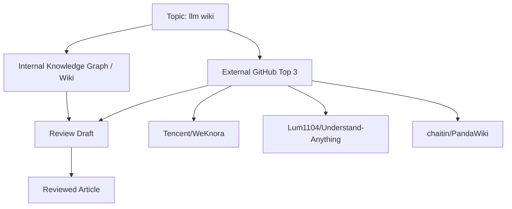

# LLM Wiki: LLM 시대의 지식베이스는 어떻게 진화하는가

## 1. 왜 지금 이 주제가 중요한가

LLM Wiki는 단순한 “문서 저장소”가 아니라, **대규모 언어모델(LLM)을 중심으로 문서를 읽고, 요약하고, 연결하고, 점검하며, 지속적으로 정련되는 지식 시스템**을 의미합니다.  
이 주제가 중요해진 이유는 분명합니다.

- **RAG(Retrieval-Augmented Generation)의 한계**가 드러났기 때문입니다.  
  검색만 잘한다고 지식이 축적되지는 않습니다. 문서가 늘어날수록 중복, 충돌, 오래된 정보가 누적됩니다.
- **개인/팀 지식의 생애주기**가 길어졌기 때문입니다.  
  한 번 만든 위키는 끝이 아니라 시작이며, 시간이 지날수록 업데이트·정합성·관계망이 중요해집니다.
- **LLM이 문서 작업의 “사용자”를 넘어 “유지보수자”가 되는 단계**로 이동하고 있기 때문입니다.  
  요약, 링크 제안, 모순 탐지, 문서 개편 같은 작업을 자동화하면 위키는 정적인 저장소가 아니라 살아있는 지식 베이스가 됩니다.

내부 자료에서도 이 방향이 분명합니다.  
주어진 내부 참조는 “**AI가 스스로 진화하는 지식 베이스**”라는 개념을 중심으로, **Claude Code와 Obsidian을 활용해 문서를 자동 읽기·요약·연결·모순 탐지까지 수행하는 워크플로**를 강조합니다. 이는 LLM Wiki를 “검색 가능한 노트”가 아니라 **지식이 누적·정련되는 시스템**으로 보는 관점입니다.  
[내부 참고: `references/pages/2026-04-25-fornewchallenge.tistory.com-ai-llm-wiki.md`](#참고-자료)

---

## 2. 내부 Knowledge Graph에서 본 핵심 개념

내부 Knowledge Graph에는 LLM Wiki와 직접 연결된 핵심 개념이 확인됩니다.

### 2.1 Claude Code
내부 그래프에서 `claude-code`는 해당 주제 문서를 ingest하는 과정에서 처음 관찰된 개념으로 표시됩니다.  
즉, 이 저장소의 맥락에서는 **LLM Wiki를 실무적으로 다루는 에이전트형 개발 도구**로 해석할 수 있습니다.

- 문서 읽기/작성 보조
- 파일 단위 구조 파악
- 반복 작업 자동화
- 위키 운영 흐름에 AI를 연결하는 실행 도구

### 2.2 Contradiction Detection
`contradiction-detection` 역시 같은 문맥에서 등장합니다.  
LLM Wiki의 핵심은 “잘 찾는 것”만이 아니라, **서로 충돌하는 정보와 버전 차이를 식별하는 것**입니다.

이는 위키 시스템에서 매우 중요합니다.

- 문서 간 설명 불일치 탐지
- 이전 메모와 현재 정책의 충돌 파악
- 동일 엔티티에 대한 상이한 정의 정리
- RAG 결과의 신뢰도 보정

### 2.3 “스스로 진화하는 지식 베이스”
내부 메모의 중심 문장에 따르면, 이 주제는 단순한 위키 구축이 아니라:

- 문서를 자동으로 읽고
- 핵심을 요약하고
- 관련 문서와 연결하며
- 모순까지 탐지하는

**지속적으로 정련되는 지식 시스템**을 가리킵니다.

이 관점은 LLM Wiki를 “문서 UI”가 아니라 **지식 엔진**으로 재정의합니다.

---

## 3. 관련 내부 지식과 기존 메모

내부 그래프가 제공하는 정보는 많지 않지만, 방향성은 명확합니다.

### 확인된 내부 맥락
- `wiki/concepts/claude-code.md`
- `wiki/concepts/contradiction-detection.md`
- `references/pages/2026-04-25-fornewchallenge.tistory.com-ai-llm-wiki.md`

### 내부 메모에서 읽히는 해석
- LLM Wiki는 **Obsidian 같은 개인 지식관리 도구**와 결합될 수 있다.
- Claude Code 같은 에이전트형 도구가 **문서 유지보수의 실행 계층**을 담당한다.
- 모순 탐지는 단순 QA가 아니라 **지식의 품질 관리 메커니즘**이다.
- RAG는 조회 중심이고, LLM Wiki는 **축적과 정련 중심**이다.

즉, 내부 지식은 LLM Wiki를 다음과 같이 정의하는 데 기여합니다.

> “문서를 저장하는 위키”가 아니라  
> “문서를 읽고, 연결하고, 갱신하고, 충돌을 줄이는 지식 운영 시스템”

---

## 4. GitHub Top 3 참고 프로젝트

아래 3개 프로젝트는 GitHub 검색 결과에서 `llm wiki`와 관련도가 높고 star 수가 높은 공개 저장소입니다.  
다만 **star 수가 높다는 사실만으로 기술적 우수성을 단정할 수는 없습니다.** 아래 내용은 공개 README와 검색 결과를 바탕으로 한 외부 참고 사례입니다.

### 4.1 Tencent/WeKnora
- URL: https://github.com/Tencent/WeKnora
- Star 수: **14,503**
- Star 수집 날짜: **2026-05-09**
- 설명: “Open-source LLM knowledge platform: turn raw documents into a queryable RAG, an autonomous reasoning agent, and a self-maintaining Wiki.”

### 4.2 Lum1104/Understand-Anything
- URL: https://github.com/Lum1104/Understand-Anything
- Star 수: **13,595**
- Star 수집 날짜: **2026-05-09**
- 설명: “Turn any code, or knowledge base (Karpathy LLM wiki), into an interactive knowledge graph you can explore, search, and ask questions about.”

### 4.3 chaitin/PandaWiki
- URL: https://github.com/chaitin/PandaWiki
- Star 수: **9,536**
- Star 수집 날짜: **2026-05-09**
- 설명: AI 대모델 기반의 오픈소스 지식베이스 구축 시스템으로, 제품 문서·기술 문서·FAQ·블로그를 빠르게 구성하고 AI 창작, AI Q&A, AI 검색을 제공.

---

## 5. 프로젝트별 강점과 한계

### 5.1 Tencent/WeKnora
**강점**
- “queryable RAG”와 “self-maintaining Wiki”를 함께 제시해, 검색과 유지보수를 하나의 제품 철학으로 묶고 있습니다.
- “autonomous reasoning agent”를 강조해 단순 QA를 넘어선 작업 흐름을 지향합니다.
- 지식 플랫폼 관점에서 꽤 넓은 범위를 커버합니다.

**한계**
- README만으로는 실제로 어떤 수준까지 자동 유지보수가 이뤄지는지 확인하기 어렵습니다.
- “self-maintaining”이라는 표현은 매력적이지만, 운영 안정성·충돌 해결·품질 보증의 범위는 별도 검증이 필요합니다.

### 5.2 Lum1104/Understand-Anything
**강점**
- “knowledge graph”를 전면에 내세워, 위키를 그래프 구조로 이해하고 탐색하는 관점을 잘 드러냅니다.
- 코드베이스와 knowledge base 모두를 대상으로 하므로, 문서 시스템과 개발자 도구의 경계를 연결합니다.
- Claude Code, Cursor, Copilot, Gemini CLI 등과의 호환성을 내세워 **agentic workflow**와 궁합이 좋습니다.

**한계**
- 그래프화는 설명력과 탐색성이 좋지만, 실제 운영에서 **노이즈 관리와 관계 품질**이 중요합니다.
- “그래프를 만들 수 있다”와 “유용한 지식 그래프를 유지할 수 있다”는 다릅니다.

### 5.3 chaitin/PandaWiki
**강점**
- 제품 문서, 기술 문서, FAQ, 블로그 등 **실제 운영 문서의 생산성**에 초점을 맞추고 있습니다.
- AI 창작, AI 검색, AI Q&A를 함께 제공해 위키를 사용자-facing knowledge portal로 확장합니다.
- 엔터프라이즈/팀 지식베이스 구축 관점에 가깝습니다.

**한계**
- 공개된 README만으로는 지식 간 연결, 모순 탐지, 장기적 정련 메커니즘의 세부 수준을 판단하기 어렵습니다.
- “위키 구축”에는 강점이 있어도, “지식 진화”까지 자동화하는지 여부는 추가 확인이 필요합니다.

---

## 6. 핵심 구조를 설명하는 Diagram

이 다이어그램은 다음 흐름을 보여줍니다.

- 주제(`llm wiki`)가 내부 지식 그래프와 외부 사례를 동시에 참조한다.
- 내부 지식은 개념 정의와 운영 철학을 제공한다.
- 외부 GitHub 사례는 구현 패턴과 제품화를 보여준다.
- 두 흐름이 합쳐져 리뷰 초안이 되고, 최종적으로 검토된 글로 정리된다.

---

## 7. Knowledge System에 적용 가능한 설계

LLM Wiki를 실제 시스템으로 설계한다면, 핵심은 다음 4계층입니다.

### 7.1 Ingestion Layer
문서를 수집하는 계층입니다.

- Markdown, Notion, Google Docs, PDF, 코드 주석 등 수집
- 변경분(diff) 기반 업데이트
- 메타데이터 추출: 작성자, 날짜, 출처, 태그, 버전

### 7.2 Understanding Layer
LLM이 문서를 해석하는 계층입니다.

- 요약
- 엔티티 추출
- 토픽 분류
- 관계 후보 생성
- 중복 문서 탐지

### 7.3 Knowledge Maintenance Layer
지식 품질을 유지하는 계층입니다.

- 모순 탐지
- 최신성 판단
- 출처 신뢰도 점검
- 링크 자동 제안
- 오래된 문서의 리라이트 제안

### 7.4 Delivery Layer
사용자에게 지식을 제공하는 계층입니다.

- 검색 UI
- 그래프 탐색 UI
- Q&A interface
- 문서 작성 보조
- 개인/팀 dashboard

이 구조에서 LLM Wiki는 단순한 knowledge base가 아니라 **지식 운영 파이프라인**이 됩니다.

---

## 8. 추천 아키텍처

실무 관점에서 추천하는 아키텍처는 다음과 같습니다.

### 권장 구성
- **Source of Truth**: Markdown/Docs 저장소
- **Indexing**: vector index + keyword index + graph index
- **LLM Orchestration**: Claude Code류 에이전트 또는 유사 자동화 계층
- **Knowledge Graph**: 문서-개념-인물-프로젝트-의존성 관계 저장
- **Quality Control**: contradiction detection, duplication detection, freshness scoring
- **UI**: Obsidian, 웹 대시보드, 검색 중심 포털

### 동작 방식
1. 새 문서가 들어온다.
2. 시스템이 요약·태깅·엔티티 추출을 수행한다.
3. 관련 문서와 연결 후보를 생성한다.
4. 충돌 가능성이 있는 문서를 표시한다.
5. 사용자가 승인하면 그래프와 문서가 함께 갱신된다.

### 핵심 원칙
- 자동화는 **추천까지**, 최종 반영은 **검토 기반**
- 검색은 **단일 벡터 검색만** 쓰지 말고, 구조화된 관계와 함께 사용
- 모든 요약은 **출처 문서 링크**를 가져야 함
- 모순 탐지는 **오탐 허용 + 수동 확인** 체계를 둬야 함

---

## 9. 구현 시 주의할 점

### 9.1 “자동”을 과신하지 말 것
LLM은 유용하지만, 항상 정확하지는 않습니다.  
특히 위키는 지식의 정합성이 중요하므로, 자동 연결과 자동 요약은 반드시 검토 절차와 결합되어야 합니다.

### 9.2 모순 탐지는 생성보다 어렵다
새 문서를 만드는 것보다, 서로 다른 문서의 충돌을 판단하는 것이 더 어렵습니다.  
동일 단어라도 맥락이 다를 수 있으므로, contradiction detection은 **문장 유사도**가 아니라 **의미·범위·시점**을 함께 봐야 합니다.

### 9.3 그래프는 많을수록 좋은 것이 아니다
그래프가 커질수록 관계가 과도하게 생성될 수 있습니다.  
유용한 그래프는 “많은 연결”이 아니라 **설명 가능한 연결**입니다.

### 9.4 최신성과 출처를 분리해야 한다
- 최신 문서가 반드시 정확한 것은 아니고
- 오래된 문서가 반드시 쓸모없는 것도 아닙니다.

따라서 문서에는 **작성일, 수정일, 출처, 검토 상태**가 함께 기록되어야 합니다.

### 9.5 위키는 검색 엔진이 아니라 운영 체계다
LLM Wiki를 단지 “검색 개선”으로 보면 한계가 있습니다.  
실제로는 문서 작성, 정리, 검토, 연결, 폐기까지 포함하는 **지식 운영체계**로 설계해야 합니다.

---

## 10. 결론

LLM Wiki는 LLM 시대의 지식 관리를 “찾는 문제”에서 “진화시키는 문제”로 바꿉니다.  
내부 지식 그래프는 이 주제를 **Claude Code**, **contradiction detection**, 그리고 **스스로 진화하는 지식 베이스**라는 관점으로 연결합니다. 외부 GitHub 사례들은 이를 제품과 워크플로 수준으로 확장하는 다양한 접근을 보여줍니다.

정리하면:

- **WeKnora**는 RAG와 self-maintaining Wiki의 결합을 보여주고,
- **Understand-Anything**은 knowledge graph 중심의 탐색성과 에이전트 호환성을 보여주며,
- **PandaWiki**는 실제 문서 운영에 AI를 결합한 제품화를 보여줍니다.

하지만 LLM Wiki의 핵심 가치는 star 수나 데모의 화려함이 아니라,  
**문서가 시간이 지날수록 더 정돈되고, 더 연결되고, 더 신뢰할 수 있게 되는가**에 있습니다.

즉, 좋은 LLM Wiki는 “문서를 많이 담는 곳”이 아니라  
**지식이 스스로 정리되도록 설계된 시스템**입니다.

---

## 11. 참고 자료

### 내부 자료
- `wiki/concepts/claude-code.md`
- `wiki/concepts/contradiction-detection.md`
- `references/pages/2026-04-25-fornewchallenge.tistory.com-ai-llm-wiki.md`
  - 제목: **🧠 AI가 스스로 진화하는 지식 베이스! LLM Wiki 구축 가이드**
  - URL: https://fornewchallenge.tistory.com/entry/%F0%9F%A7%A0-AI%EA%B0%80-%EC%8A%A4%EC%8A%A4%EB%A1%9C-%EC%A7%84%ED%99%94%ED%95%98%EB%8A%94-%EC%A7%80%EC%8B%9D-%EB%B2%A0%EC%9D%B4%EC%8A%A4-LLM-Wiki-%EA%B5%AC%EC%B6%95-%EA%B0%80%EC%9D%B4%EB%93%9C#google_vignette

### 외부 GitHub 참고 사례
- Tencent/WeKnora  
  URL: https://github.com/Tencent/WeKnora  
  Star 수: **14,503**  
  Star 수집 날짜: **2026-05-09**

- Lum1104/Understand-Anything  
  URL: https://github.com/Lum1104/Understand-Anything  
  Star 수: **13,595**  
  Star 수집 날짜: **2026-05-09**

- chaitin/PandaWiki  
  URL: https://github.com/chaitin/PandaWiki  
  Star 수: **9,536**  
  Star 수집 날짜: **2026-05-09**
